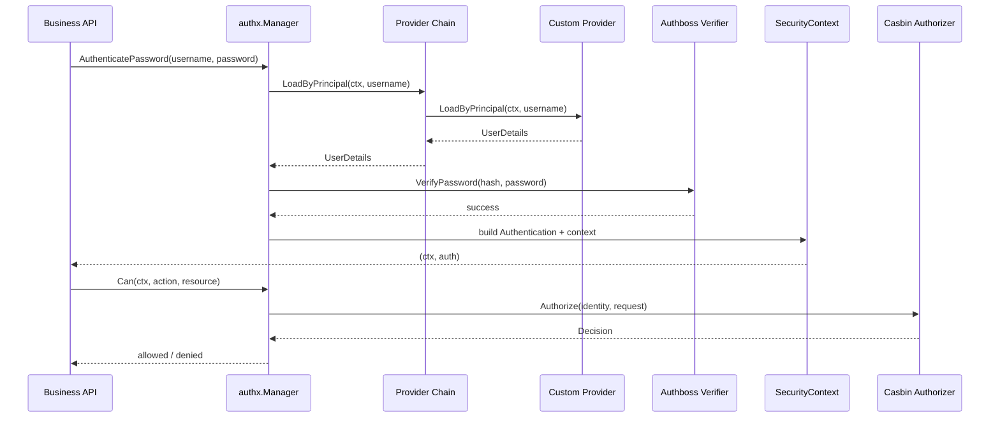

# authx

`authx` is an opinionated security library for Go.

It is built on:

- Authboss for authentication
- Casbin for authorization

English | [Chinese](./README_ZH.md)

## Design Goal

Business code should only deal with AuthX API:

- Build one `Manager`
- Authenticate user and get `Authentication` object + new `context.Context`
- Check permission with `manager.Can(...)`
- Manually call `LoadPolicies` / `ReplacePolicies` when policy changes

Authboss and Casbin remain internal implementation details.

## Core API

- `IdentityProvider`: load user data (`UserDetails`) by principal
- `InMemoryIdentityProvider`: runtime-mutable built-in provider
- `PolicySource`: load full policy snapshot (`PolicySnapshot`)
- `InMemoryPolicySource`: runtime-mutable built-in source
- `WithProvider(...)` / `WithSource(...)` option-based manager construction
- `MappedProvider[T]` interface + `WithMappedProvider[T](provider)` generic typed provider adapter
- `Manager.Authenticate(...)` / `Manager.AuthenticatePassword(...)`
- `Manager.Can(ctx, action, resource)`
- `Manager.LoadPolicies()` / `Manager.LoadPoliciesFrom(...)`
- `Manager.ReplacePolicies(...)` for manual hot reload
- `Manager.SetIdentityProviders(...)` / `Manager.AddIdentityProvider(...)` for provider chain management
- `Manager.SetPolicySources(...)` / `Manager.AddPolicySource(...)` for source chain management
- `SecurityContext` / `Authentication` helpers in context

## Quick Start

```go
providerA := authx.NewInMemoryIdentityProvider()
providerB := authx.NewInMemoryIdentityProvider()
source := authx.NewInMemoryPolicySource(authx.NewPolicySnapshot(perms, roles))

manager, err := authx.NewManager(
    authx.WithSource(source),
    authx.WithProvider(providerA),
    authx.WithProvider(providerB),
)
if err != nil {
    panic(err)
}

_, err = manager.LoadPolicies(context.Background()) // manual load / refresh
if err != nil {
    panic(err)
}

ctx, auth, err := manager.AuthenticatePassword(context.Background(), "alice", "secret")
if err != nil {
    panic(err)
}

allowed, err := manager.Can(ctx, "read", "order:1001")
if err != nil {
    panic(err)
}

fmt.Println(auth.Identity().ID(), allowed)
```

Providers and policy source are runtime objects, not compile-time fixed values.
You can maintain multiple authentication providers and update users/policies at runtime.

## Generic Principal Payload

`UserDetails` supports `Payload any`.  
For mapped providers, payload is attached automatically and you can read it with generic helpers:

```go
type SQLiteMappedProvider struct {
    db *sql.DB
}

func (p SQLiteMappedProvider) LoadByPrincipal(ctx context.Context, principal string) (SQLiteUser, error) { ... }
func (p SQLiteMappedProvider) MapToUserDetails(ctx context.Context, principal string, u SQLiteUser) (authx.UserDetails, error) { ... }

manager, err := authx.NewManager(
    authx.WithMappedProvider(SQLiteMappedProvider{db: db}),
)

ctx, _, err := manager.AuthenticatePassword(context.Background(), "alice", "secret")
if err != nil { panic(err) }

principal, ok := authx.CurrentPrincipalAs[MyUser](ctx)
if !ok { panic("principal type mismatch") }
```

## Logging (slog)

`authx` accepts standard library `*slog.Logger` and logs key nodes:

- manager lifecycle and policy reload
- provider chain lookup
- authentication verify result
- authorization decision

```go
appLogger, err := logx.New(logx.WithConsole(true), logx.WithLevel(logx.DebugLevel))
if err != nil { panic(err) }
defer appLogger.Close()

manager, err := authx.NewManager(
    authx.WithLogger(logx.NewSlog(appLogger)),
    authx.WithSource(source),
    authx.WithProvider(provider),
)
```

## Optional Observability

`authx` can emit optional metrics/traces via `WithObservability(...)`.

```go
otelObs := otelobs.New()
promObs := promobs.New()
obs := observability.Multi(otelObs, promObs)

manager, err := authx.NewManager(
    authx.WithObservability(obs),
    authx.WithSource(source),
    authx.WithProvider(provider),
)
```

## Authentication Flow (Mermaid)



## Custom Provider Demo (Mermaid)

```mermaid
flowchart LR
    R[UserRepository<br/>DB/Redis/HTTP] --> P[Custom IdentityProvider]
    P --> M[authx.NewManager<br/>WithProvider(provider)]
    M --> A[AuthenticatePassword]
    A --> C[SecurityContext + Authentication]
    C --> Z[Can(action, resource)]
```

```go
type UserRepository interface {
    FindByPrincipal(ctx context.Context, principal string) (userRecord, error)
}

type RepositoryIdentityProvider struct {
    repo UserRepository
}

func (p *RepositoryIdentityProvider) LoadByPrincipal(ctx context.Context, principal string) (authx.UserDetails, error) {
    record, err := p.repo.FindByPrincipal(ctx, principal)
    if err != nil {
        return authx.UserDetails{}, err
    }
    return authx.UserDetails{
        ID:           record.ID,
        Principal:    record.Principal,
        PasswordHash: record.PasswordHash,
        Name:         record.Name,
    }, nil
}

manager, err := authx.NewManager(
    authx.WithProvider(&RepositoryIdentityProvider{repo: repo}),
    authx.WithSource(policySource),
)
```

Full runnable example: [custom_provider](./examples/custom_provider)

## Manual Policy Hot Reload

You can hot reload policies at runtime without exposing Casbin details:

```go
// Reload from configured source
version, err := manager.LoadPolicies(ctx)

// Reload from a new source and switch default source
version, err = manager.LoadPoliciesFrom(ctx, anotherSource)

// Replace directly with in-memory snapshot
version, err = manager.ReplacePolicies(ctx, authx.NewPolicySnapshot(perms, roles))

// Replace provider chain at runtime
err = manager.SetIdentityProviders(providerA, providerB, providerC)

// Append one provider to chain
err = manager.AddIdentityProvider(providerD)

// Replace source chain at runtime
err = manager.SetPolicySources(sourceA, sourceB)

// Append one source to chain
err = manager.AddPolicySource(sourceC)
```

`version` is incremented on each successful reload.

## Runtime Pieces

- [manager.go](./manager.go): high-level facade API
- [security_context.go](./security_context.go): security context + authentication object
- [authboss_authenticator.go](./authboss_authenticator.go): internal authboss authenticator
- [casbin_authorizer.go](./casbin_authorizer.go): internal casbin authorizer

## Examples

- [authboss_password](./examples/authboss_password): login only
- [casbin_authorizer](./examples/casbin_authorizer): manual policy hot reload
- [quickstart](./examples/quickstart): end-to-end flow with provider + policy source
- [custom_provider](./examples/custom_provider): implement `IdentityProvider` with repository abstraction
- [sqlite_auth](./examples/sqlite_auth): load user from SQLite and authenticate
- [redis_auth](./examples/redis_auth): load user from Redis and authenticate (`REDIS_ADDR` default `127.0.0.1:6379`)
- [observability](./examples/observability): wire `authx` with optional OTel + Prometheus observability

## Testing

```bash
go test ./authx/...

# run benchmarks
go test ./authx -run ^$ -bench BenchmarkManager -benchmem
```
