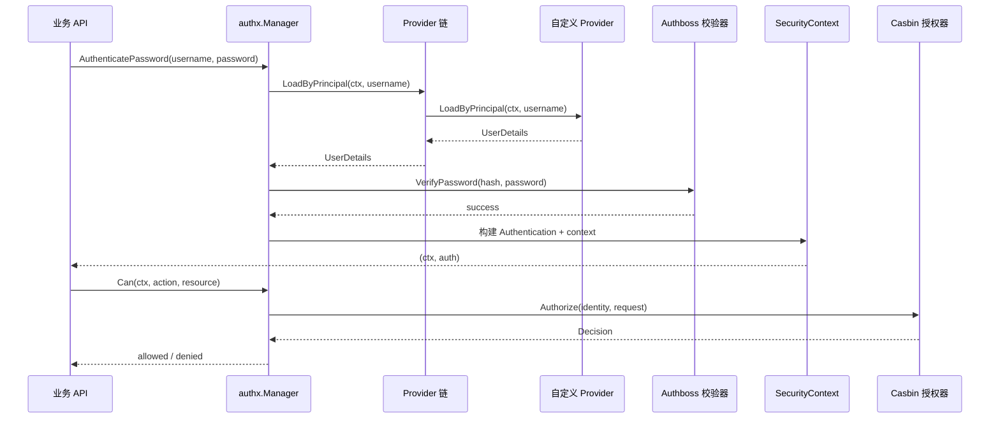

# authx

`authx` 是一个面向 Go 的 Opinionated Security Library。

底层固定依赖：

- Authboss（认证）
- Casbin（授权）

[English](./README.md) | Chinese

## 设计目标

业务代码只面向 AuthX 自己的 API：

- 构建一个 `Manager`
- 登录后拿到 `Authentication` 对象和新的 `context.Context`
- 用 `manager.Can(...)` 做权限校验
- 权限变更时手动调用 `LoadPolicies` / `ReplacePolicies` 触发热更新

业务层不需要直接接触 Authboss/Casbin 原生 API。

## 核心 API

- `IdentityProvider`：按 principal 加载 `UserDetails`
- `InMemoryIdentityProvider`：内置可变 Provider（运行时可更新）
- `PolicySource`：加载完整策略快照 `PolicySnapshot`
- `InMemoryPolicySource`：内置可变策略源（运行时可更新）
- `WithProvider(...)` / `WithSource(...)`：基于选项的 Manager 构建方式
- `MappedProvider[T]` 接口 + `WithMappedProvider[T](provider)`：泛型强类型 Provider 适配器
- `Manager.Authenticate(...)` / `Manager.AuthenticatePassword(...)`
- `Manager.Can(ctx, action, resource)`
- `Manager.LoadPolicies()` / `Manager.LoadPoliciesFrom(...)`
- `Manager.ReplacePolicies(...)`（手动热更新）
- `Manager.SetIdentityProviders(...)` / `Manager.AddIdentityProvider(...)`（Provider 链管理）
- `Manager.SetPolicySources(...)` / `Manager.AddPolicySource(...)`（Source 链管理）
- `SecurityContext` / `Authentication` 上下文辅助方法

## 快速开始

```go
providerA := authx.NewInMemoryIdentityProvider()
providerB := authx.NewInMemoryIdentityProvider()
source := authx.NewInMemoryPolicySource(authx.NewPolicySnapshot(perms, roles))

manager, err := authx.NewManager(
    authx.WithSource(source),
    authx.WithProvider(providerA),
    authx.WithProvider(providerB),
)
if err != nil {
    panic(err)
}

_, err = manager.LoadPolicies(context.Background()) // 手动加载/刷新权限
if err != nil {
    panic(err)
}

ctx, auth, err := manager.AuthenticatePassword(context.Background(), "alice", "secret")
if err != nil {
    panic(err)
}

allowed, err := manager.Can(ctx, "read", "order:1001")
if err != nil {
    panic(err)
}

fmt.Println(auth.Identity().ID(), allowed)
```

这里的 Provider/PolicySource 是运行时对象，不是“注册时写死”的静态配置。
你可以维护多个 Authentication Provider，并在运行时更新用户或策略。

## 泛型 Principal 载荷

`UserDetails` 支持 `Payload any`。  
对于 `MappedProvider[T]`，载荷会自动挂到认证身份上，可通过泛型辅助函数读取：

```go
type SQLiteMappedProvider struct {
    db *sql.DB
}

func (p SQLiteMappedProvider) LoadByPrincipal(ctx context.Context, principal string) (SQLiteUser, error) { ... }
func (p SQLiteMappedProvider) MapToUserDetails(ctx context.Context, principal string, u SQLiteUser) (authx.UserDetails, error) { ... }

manager, err := authx.NewManager(
    authx.WithMappedProvider(SQLiteMappedProvider{db: db}),
)

ctx, _, err := manager.AuthenticatePassword(context.Background(), "alice", "secret")
if err != nil { panic(err) }

principal, ok := authx.CurrentPrincipalAs[MyUser](ctx)
if !ok { panic("principal type mismatch") }
```

## 日志（slog）

`authx` 支持注入标准库 `*slog.Logger`，会在关键节点输出日志：

- manager 生命周期与策略热更新
- provider 链路查找
- 认证校验结果
- 授权决策结果

```go
appLogger, err := logx.New(logx.WithConsole(true), logx.WithLevel(logx.DebugLevel))
if err != nil { panic(err) }
defer appLogger.Close()

manager, err := authx.NewManager(
    authx.WithLogger(logx.NewSlog(appLogger)),
    authx.WithSource(source),
    authx.WithProvider(provider),
)
```

## 可选可观测性

`authx` 支持通过 `WithObservability(...)` 注入可选指标/追踪能力。

```go
otelObs := otelobs.New()
promObs := promobs.New()
obs := observability.Multi(otelObs, promObs)

manager, err := authx.NewManager(
    authx.WithObservability(obs),
    authx.WithSource(source),
    authx.WithProvider(provider),
)
```

## 认证流程图（Mermaid）



## 自定义 Provider 示例图（Mermaid）

```mermaid
flowchart LR
    R[UserRepository<br/>DB/Redis/HTTP] --> P[自定义 IdentityProvider]
    P --> M[authx.NewManager<br/>WithProvider(provider)]
    M --> A[AuthenticatePassword]
    A --> C[SecurityContext + Authentication]
    C --> Z[Can(action, resource)]
```

```go
type UserRepository interface {
    FindByPrincipal(ctx context.Context, principal string) (userRecord, error)
}

type RepositoryIdentityProvider struct {
    repo UserRepository
}

func (p *RepositoryIdentityProvider) LoadByPrincipal(ctx context.Context, principal string) (authx.UserDetails, error) {
    record, err := p.repo.FindByPrincipal(ctx, principal)
    if err != nil {
        return authx.UserDetails{}, err
    }
    return authx.UserDetails{
        ID:           record.ID,
        Principal:    record.Principal,
        PasswordHash: record.PasswordHash,
        Name:         record.Name,
    }, nil
}

manager, err := authx.NewManager(
    authx.WithProvider(&RepositoryIdentityProvider{repo: repo}),
    authx.WithSource(policySource),
)
```

可运行示例见：[custom_provider](./examples/custom_provider)

## 手动策略热更新

运行时可以热更新权限，不需要暴露 Casbin 细节：

```go
// 从默认 source 重载
version, err := manager.LoadPolicies(ctx)

// 指定新 source 重载，并切换默认 source
version, err = manager.LoadPoliciesFrom(ctx, anotherSource)

// 直接用内存快照替换
version, err = manager.ReplacePolicies(ctx, authx.NewPolicySnapshot(perms, roles))

// 运行时替换整条 Provider 链
err = manager.SetIdentityProviders(providerA, providerB, providerC)

// 运行时追加一个 Provider
err = manager.AddIdentityProvider(providerD)

// 运行时替换整条 Source 链
err = manager.SetPolicySources(sourceA, sourceB)

// 运行时追加一个 Source
err = manager.AddPolicySource(sourceC)
```

每次成功热更新，`version` 自增。

## 主要实现文件

- [manager.go](./manager.go)：高阶门面 API
- [security_context.go](./security_context.go)：安全上下文与认证对象
- [authboss_authenticator.go](./authboss_authenticator.go)：内部 Authboss 认证器
- [casbin_authorizer.go](./casbin_authorizer.go)：内部 Casbin 授权器

## 示例

- [authboss_password](./examples/authboss_password)：仅登录认证
- [casbin_authorizer](./examples/casbin_authorizer)：手动热更新策略
- [quickstart](./examples/quickstart)：provider + policy source 的完整流程
- [custom_provider](./examples/custom_provider)：基于仓储抽象实现 `IdentityProvider`
- [sqlite_auth](./examples/sqlite_auth)：从 SQLite 加载用户并认证
- [redis_auth](./examples/redis_auth)：从 Redis 加载用户并认证（`REDIS_ADDR` 默认 `127.0.0.1:6379`）
- [observability](./examples/observability)：演示 `authx` 接入可选 OTel + Prometheus

## 测试

```bash
go test ./authx/...

# 运行 benchmark
go test ./authx -run ^$ -bench BenchmarkManager -benchmem
```
